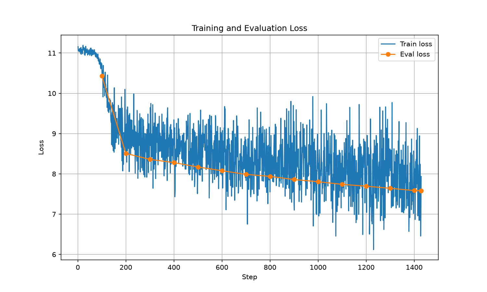
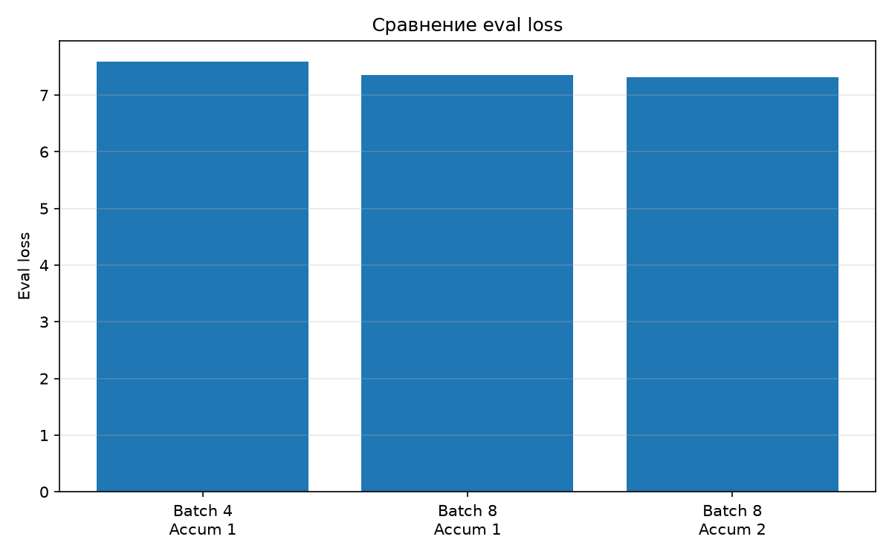

# Мини-предобучение Qwen3 на русской Википедии

## Цель

Обучить модель Qwen3 с нуля на русской Википедии в течение 15 минут и исследовать влияние параметров обучения на `eval_loss`.

## Данные

Использовался датасет `wikimedia/wikipedia`, конфигурация `20231101.ru`.

- Всего: 1 945 063 примера
- Validation: первые 5000 примеров
- Train: 1 940 063 примера
- Максимальная длина: 512 токенов
- Токенизатор: `ai-forever/rugpt3small_based_on_gpt2`

## Модель

Использовалась архитектура Qwen3, инициализированная с нуля.

- Hidden size: 2048
- Layers: 12
- Attention heads: 16
- Key-value heads: 8
- Intermediate size: 8192
- Параметров: 960 881 664

Обучение проводилось на NVIDIA A100 80 GB в BF16.

## Эксперименты

Общие параметры:

- Время обучения: 15 минут
- Learning rate: `5e-5`
- Optimizer: `adamw_torch_fused`
- BF16: `True`
- TF32: `True`
- `torch_compile`: `False`

`torch_compile` был отключён из-за ошибки Triton/CUDA при запуске.

| № | Batch size | Gradient accumulation | Шагов | Train loss | Eval loss |
|---|---:|---:|---:|---:|---:|
| 1 | 4 | 1 | 1429 | 8.596955 | 7.584191 |
| 2 | 8 | 1 | 1291 | 8.452563 | 7.357464 |
| 3 | 8 | 2 | 1001 | 8.478079 | **7.311131** |

При увеличении batch size с 4 до 8 `eval_loss` снизился с 7.584191 до 7.357464.

После увеличения `gradient_accumulation_steps` с 1 до 2 `eval_loss` снизился до 7.311131. При этом за 15 минут выполнялось меньше шагов.

## Графики

### Loss

### Сравнение экспериментов

## Генерация

Для проверки модели использовался промпт:

`Эмпатия это`

Модель генерировала малосвязный текст. В нём встречались характерные для Википедии конструкции, годы, места и события, но связного определения понятия «эмпатия» модель не сформировала.

## Вывод

Был реализован полный цикл мини-предобучения: подготовка датасета, токенизация, создание модели Qwen3 с нуля, обучение и генерация текста.

Из трёх экспериментов минимальный `eval_loss` получен при `batch_size=8` и `gradient_accumulation_steps=2` — **7.311131**.
